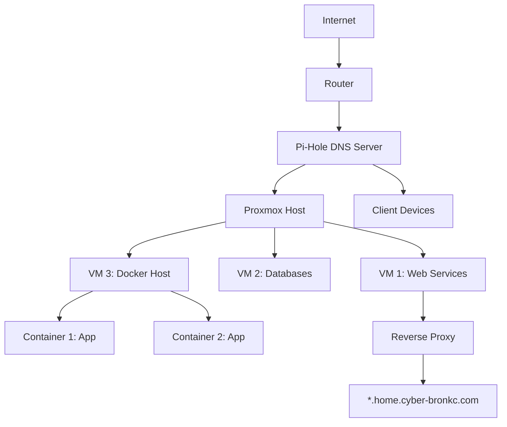
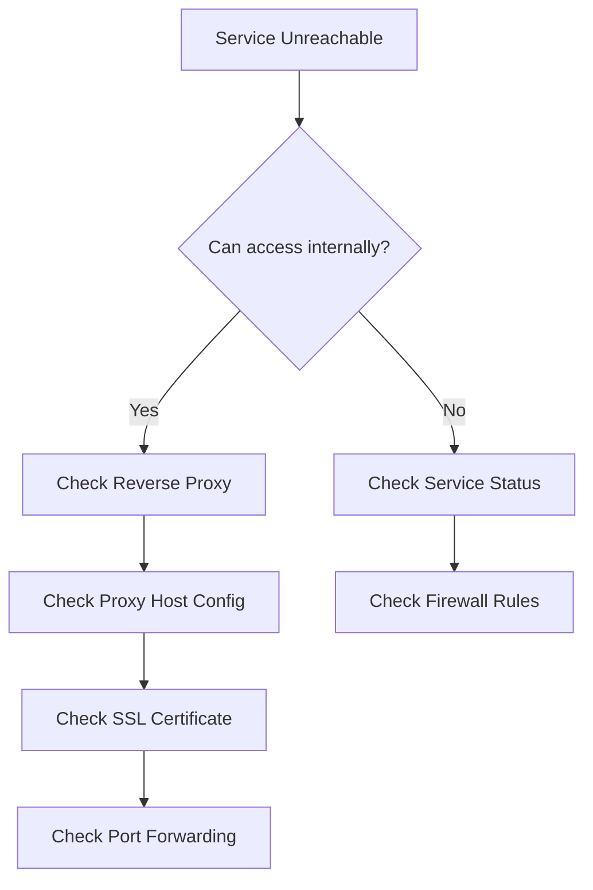

#DeepSeek: Homelab DNS and Reverse Proxy Guide with Pi-Hole

```markdown
# Homelab DNS & Reverse Proxy Configuration Guide

## Table of Contents
1. [Network Overview](#network-overview)
2. [Pi-Hole Local DNS Setup](#pi-hole-local-dns-setup)
3. [Network Organization Recommendations](#network-organization-recommendations)
4. [Reverse Proxy Fundamentals](#reverse-proxy-fundamentals)
5. [Full Configuration Example](#full-configuration-example)
6. [Security Considerations](#security-considerations)
7. [Maintenance & Troubleshooting](#maintenance--troubleshooting)
```

## 1. Network Overview <a name="network-overview"></a>


**Key Components:**
- Domain: `home.cyber-bronkc.com` (points to router's public IP)
- Pi-Hole: Primary DNS server (ad-blocking + local resolution)
- Proxmox: Virtualization host
- Reverse Proxy: Routes traffic to internal services

## 2. Pi-Hole Local DNS Setup <a name="pi-hole-local-dns-setup"></a>

### Step 1: Configure Local DNS Records
1. Access Pi-Hole admin interface (`http://pi.hole/admin`)
2. Navigate to **Local DNS** > **DNS Records**
3. Add entries for your internal services:

   | Domain                   | IP Address   | Description       |
   |--------------------------|--------------|-------------------|
   | proxmox.home.internal    | 192.168.1.10 | Proxmox host      |
   | pihole.home.internal     | 192.168.1.5  | Pi-Hole itself    |
   | nas.home.internal        | 192.168.1.20 | NAS device        |
   | docker-host.home.internal| 192.168.1.30 | Docker host VM    |

### Step 2: Configure Conditional Forwarding
1. In Pi-Hole settings:
   - **Settings** > **DNS** 
   - Enable "Use Conditional Forwarding"
   - Local network: `192.168.1.0/24`
   - Local domain: `home.internal`

### Step 3: DHCP Configuration (Optional)
Configure router DHCP to:
- Set Pi-Hole as primary DNS (192.168.1.5)
- Set secondary DNS as Cloudflare/Google (1.1.1.1 or 8.8.8.8)
- Set domain name: `home.internal`

## 3. Network Organization Recommendations <a name="network-organization-recommendations"></a>

### IP Addressing Scheme
| Subnet         | Purpose          | DHCP Range       | Static Range     |
|----------------|------------------|------------------|------------------|
| 192.168.1.0/24 | Main Network     | .100-.200        | .2-.99           |
| 192.168.2.0/24 | IoT Devices      | .100-.200        | N/A              |
| 192.168.3.0/24 | Guest Network    | .100-.200        | N/A              |

### VLAN Recommendations
1. **VLAN 10 (192.168.1.0/24):** Trusted devices, servers, management interfaces
2. **VLAN 20 (192.168.2.0/24):** IoT devices (restricted internet access)
3. **VLAN 30 (192.168.3.0/24):** Guest network (internet only)

### DNS Zones
1. `home.cyber-bronkc.com` - Public-facing services
2. `home.internal` - Private internal network
3. `iot.home.internal` - IoT devices (separate zone)

## 4. Reverse Proxy Fundamentals <a name="reverse-proxy-fundamentals"></a>

### What is a Reverse Proxy?
Acts as an intermediary between clients and servers:
- Receives client requests
- Forwards to appropriate backend server
- Returns response to client

### Benefits for Homelab:
1. **SSL Termination:** Handle HTTPS encryption once
2. **Port Management:** Access multiple services on port 443
3. **Access Control:** Centralized authentication
4. **Load Balancing:** Distribute traffic
5. **Hostname Routing:** `service.home.cyber-bronkc.com` → internal IP

### Recommended Solutions:
1. **Nginx Proxy Manager** (User-friendly GUI)
2. **Traefik** (Docker-native, automatic config)
3. **Caddy** (Automatic HTTPS)

## 5. Full Configuration Example <a name="full-configuration-example"></a>

### Step 1: Reverse Proxy Setup (Nginx Proxy Manager)
1. Deploy in Docker:
   ```bash
   docker run -d \
     --name nginx-proxy-manager \
     -p 80:80 \
     -p 443:443 \
     -p 81:81 \
     -v npm_data:/data \
     -v npm_letsencrypt:/etc/letsencrypt \
     jc21/nginx-proxy-manager:latest
   ```

2. Access admin UI at `http://<docker-host-ip>:81`

### Step 2: Port Forwarding on Router
| External Port | Internal IP        | Internal Port | Service          |
|---------------|--------------------|---------------|------------------|
| 443           | 192.168.1.30       | 443           | Reverse Proxy    |
| 80            | 192.168.1.30       | 80            | HTTP Redirect    |

### Step 3: Configure Proxy Hosts
1. In Nginx Proxy Manager:
   - **Hosts** > **Proxy Hosts** > Add Proxy Host
   - Domain: `pihole.home.cyber-bronkc.com`
   - Scheme: `http`
   - Forward IP: `192.168.1.5`
   - Forward Port: `80`
   - SSL: Request new certificate (Let's Encrypt)

2. Repeat for other services:
   - `proxmox.home.cyber-bronkc.com` → 192.168.1.10:8006
   - `nas.home.cyber-bronkc.com` → 192.168.1.20:443

### Step 4: Local DNS Overrides (Pi-Hole)
Create CNAME records in Pi-Hole:
```
pihole.home.cyber-bronkc.com  CNAME  reverse-proxy.home.internal
proxmox.home.cyber-bronkc.com CNAME  reverse-proxy.home.internal
```

### Step 5: Dynamic DNS Configuration
If using dynamic IP:
1. Router: Configure DDNS client (supports providers like No-IP, DuckDNS)
2. Cloudflare: Use API script to update `home.cyber-bronkc.com` A record

## 6. Security Considerations <a name="security-considerations"></a>

### Essential Security Practices:
1. **Firewall Rules:**
   - Restrict Proxmox management interface to VLAN 10 only
   - Block all inbound traffic except 443/80 to reverse proxy
   
2. **Reverse Proxy Security:**
   - Enable HSTS in Nginx settings
   - Set up basic auth for sensitive services
   - Implement IP whitelisting for admin interfaces

3. **Pi-Hole Security:**
   - Change default admin password
   - Enable API only when needed
   - Regular updates (`pihole -up`)

4. **Domain Security:**
   - Use Cloudflare proxy to hide home IP
   - Enable DNSSEC
   - Set TTL to 5 minutes for DDNS

## 7. Maintenance & Troubleshooting <a name="maintenance--troubleshooting"></a>

### Common Commands:
```bash
# Check DNS resolution
dig proxmox.home.internal @192.168.1.5

# Test port forwarding
curl -I https://home.cyber-bronkc.com

# View reverse proxy logs
docker logs nginx-proxy-manager

# Flush DNS cache (client side)
ipconfig /flushdns  # Windows
sudo systemd-resolve --flush-caches  # Linux
```

### Troubleshooting Flowchart


### Maintenance Tasks:
1. **Weekly:**
   - Update Pi-Hole (`pihole -up`)
   - Check certificate expiration in reverse proxy
   - Backup Pi-Hole config (`pihole -a -t`)

2. **Monthly:**
   - Review firewall rules
   - Audit DNS queries in Pi-Hole
   - Rotate API keys/credentials

3. **Quarterly:**
   - Review port forwarding rules
   - Update domain security settings
   - Test disaster recovery procedures
```

## Final Notes
- **DNS Hierarchy:** Use `.home.internal` for private/internal services and `home.cyber-bronkc.com` for public-facing services
- **Reverse Proxy Placement:** Deploy on a dedicated VM/LXC container for best performance
- **Backup Strategy:** Regularly back up:
  - Pi-Hole config (`/etc/pihole`)
  - Reverse Proxy config (Docker volumes)
  - Proxmox VM configurations

This setup provides secure, organized access to homelab services while maintaining ad-blocking benefits. Adjust IP ranges and subnets according to your network size and complexity.
```